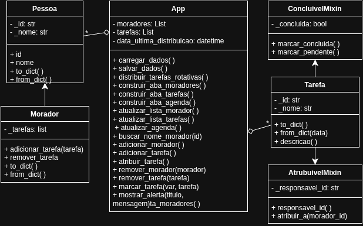
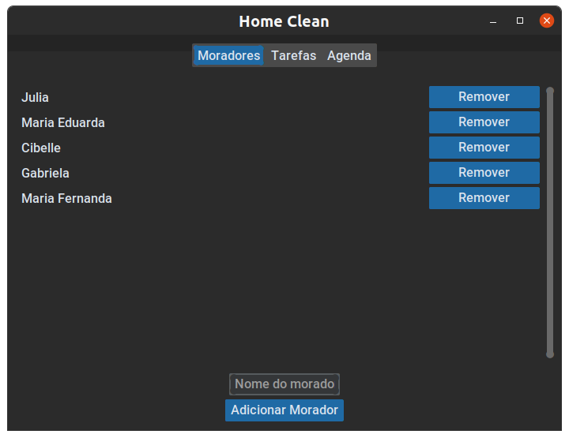
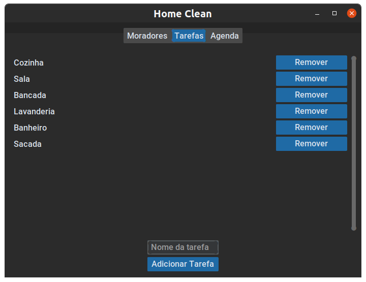
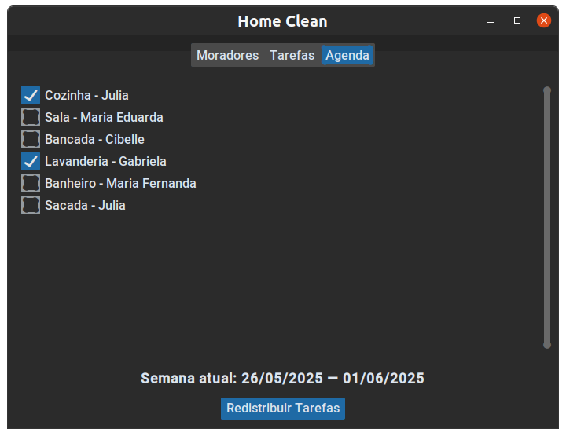

# 🧹 Sistema de Organização Doméstica

## 📌 Definição do Problema
O sistema tem como objetivo facilitar a organização de tarefas em uma residência com múltiplos moradores. Ele permite cadastrar moradores, adicionar tarefas domésticas e acompanhar a execução dessas tarefas de forma equilibrada e automática, com distribuição justa das responsabilidades.


## ✅ Casos de Uso

### 1. Cadastrar Morador
- **Ator:** Usuário
- **Descrição:** O usuário insere o nome de um novo morador no sistema.
- **Fluxo:** Nome digitado → Botão "Adicionar Morador" → Morador salvo.

### 2. Cadastrar Tarefa
- **Ator:** Usuário  
- **Descrição:** O usuário insere o nome da tarefa. O sistema distribui automaticamente essa tarefa ao morador com menos tarefas.  
- **Fluxo:**
  1. Nome da tarefa digitado
  2. Botão "Adicionar Tarefa" pressionado
  3. Sistema usa o `distribuir_tarefas_rotativa` para definir o morador responsável
  4. Tarefa salva e atribuída automaticamente
  4. Se houver alguma mudança de morador ou tarefa e o sistema não redistribua as responsabilidade, existe um botão `redistribuir` para que seja feito manualmente

### 3. Marcar Tarefa como Concluída
- **Ator:** Usuário  
- **Descrição:** O usuário marca a tarefa como concluída usando um checkbox.  
- **Fluxo:** Tarefa marcada → Estado salvo automaticamente → Interface atualizada

### 4. Visualizar Tarefas de Cada Morador
- **Ator:** Usuário  
- **Descrição:** O sistema mostra todas as tarefas cadastradas, agrupadas por morador, com seus respectivos status.  
- **Fluxo:** Interface carrega lista → Lista exibida em tempo real


## 🏗️ Arquitetura
```
HOME_CLEAN/
├── main.py                     # Arquivo principal da aplicação          
├── README.md                   # Documentação do projeto
├── testbech_01.py              # Script de teste
├── testbech_02.py              # Script de teste
├── testbech_03.py              # Script de teste
├── img/                        
|   ├── aba_agenda.png
|   ├── aba_morador.png
|   ├── aba_tarefa.png
|   └── diagrama.png            
└── package/                    
    ├── funcionamento/          
    │   ├── __init__.py
    │   └── interface.py        # Interface gráfica com CustomTkinter
    ├── modelos/                
    │   ├── __init__.py
    │   ├── mixins.py           # Funcionalidades auxiliares
    │   ├── morador.py          # Classe Morador
    │   ├── pessoa.py           # Classe Pessoa
    │   └── tarefa.py           # Classe Tarefa
    └── serelizacao/
        └── dados.json          # Armazenamento de dados
```


## 🧪 Relacionamentos de POO Aplicados
- ✅ **Encapsulamento**: Atributos protegidos com propriedades (`@property` e setters) implementados nas classes `Pessoa`, `Morador` e `Tarefa`.
- ✅ **Herança**: A classe `Morador` herda de `Pessoa`, reaproveitando atributos e métodos comuns.
- ✅ **Composição forte**: A classe principal `App` contém listas de objetos `Morador` e `Tarefa`, gerenciando seu ciclo de vida.
- ✅ **Associação fraca**:  A classe `Tarefa` mantém uma referência ao `Morador` responsável apenas pelo `id` (`responsavel_id`), sem criar dependência direta.
- ✅ **Polimorfismo (potencial)**: Métodos como `to_dict()` e `from_dict()` são implementados em várias classes, permitindo tratamento uniforme para serialização e desserialização dos objetos.


## 💾 Serialização
Os dados dos moradores e tarefas são armazenados em arquivos `.json` por meio de dicionários serializados e desserializados.


## 🖼️ Interface Gráfica
A interface é feita com `CustomTkinter` e possui:
- Campo para cadastro de moradores com validação de nomes únicos e formatação automática (primeira letra maiúscula).
- Campo para cadastro de tarefas, também com validação para evitar nomes duplicados.
- Combobox para seleção e atribuição de moradores às tarefas.
- Listagem de tarefas com indicação do morador responsável e status (concluída ou não).
- Checkbox interativo para marcar tarefas como concluídas, atualizando o estado em tempo real.
- Aba dedicada à agenda que mostra a distribuição das tarefas e permite redistribuição semanal automática.
- Pop-ups de alerta personalizados para feedback ao usuário (ex.: ao tentar adicionar nomes repetidos).


## 🧩 Diagrama de classes


## 📷 Exibição visual do projeto




## 🚀 Como Executar

### Pré-requisitos
- Python 3.10+
- `customtkinter` instalado (instale com `pip install customtkinter`)


### Executar
```bash
python3 main.py
